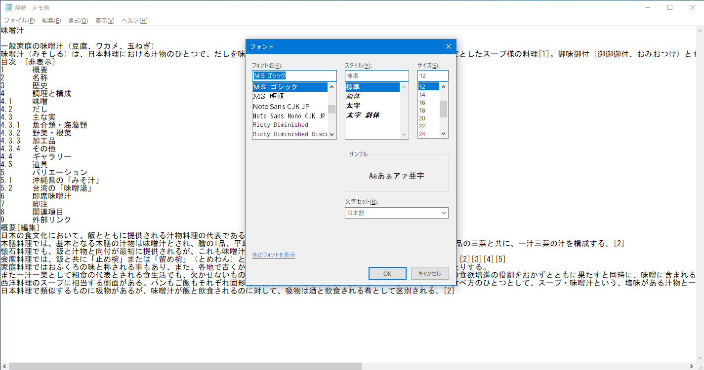

# This is a python script that removing a part of GASP table and bitmap data in Microsoft TrueType Collection font.

## Description
Windows 10 Creators Update で ClearType が[TTF でも縦方向に Anti-Alias するようになった](http://silight.hatenablog.jp/entry/2017/05/03/144138)ということなので、TTF 内の GASP テーブルの不要部分を削除しました。これだけで綺麗に表示されるようになりました。まだ、FreeType にすら劣りますが、これまでのフォントレンダリングと比べたらものすごいマシです。MS が日本語を無視してから約二十年、長かった...。


## Result
| フォント                            | 結果 | 備考        |
|:------------------------------------|:----:|:------------|
| msgothic.ttc (MS Gothic)            | OK   | No problem. |
| msgothic.ttc (MS PGothic)           | OK   | No problem. |
| msgothic.ttc (MS UI Gothic)         | OK   | No problem. |
| meiryo.ttc (Meiryo)                 | OK   | No problem. |
| meiryo.ttc (Meiryo Italic)          | OK   | No problem. |
| meiryo.ttc (Meiryo UI)              | OK   | No problem. |
| meiryo.ttc (Meiryo UI Italic)       | OK   | No problem. |
| meiryob.ttc (Meiryo Bold)           | OK   | No problem. |
| meiryob.ttc (Meiryo Italic Bold)    | OK   | No problem. |
| meiryob.ttc (Meiryo UI Bold)        | OK   | No problem. |
| meiryob.ttc (Meiryo UI Italic Bold) | OK   | No problem. |

YuGo* の結果は割愛。


### Screenshot
GDI も DW もそこそこ綺麗になりました。縦方向 AA がデカイ！下のスクショは、msgothic, meiryo[b], YuGoth[BLMR] の GASP テーブルの一部とビットマップフォントデータを削除し、どのフォントサイズでもスムージングのみ、すなわち hinting を無視するようにしたものです。映ってる大部分が源真じゃあないかってのはありますが、分かる人が見れば分かると思います。hook 系アプリが必要ないので Windows Update でコケたり、特定のアプリが動かなかったり、GSOD になったり、ということはありません。

本来ならフォントデータをいじるのではなく、ClearType が hinting 情報とフォントサイズ依存情報を無視すべきだと思うのですが、未だに MS はそれをしないのが理解できません。


個別にスクショを撮りました。GitHub 上では分からないと思いますので画像をダウンロードして、画像ビューワでご覧ください。

### cmd (MS Gothic)
bash.exe もこの描画になるので WSL で色々と遊びたくなります。


### Edge
このスクショでは Meiryo を表示しています。ClearType + 既存 Meiryo 特有の崩れた字体にならずバランスがとても良くなります。


### Flash Player Manager (MS UI Gothic)


### Install Sheld (MS UI Gothic)


### notepad (MS Gothic)


### Store App (YuGoth*)
YuGothic 系は違いが小さいですが、文字によって字体のバランスが良くなっています。やはり今までの ClearType は害悪。


## USAGE
### Preparing
This script makes a core dump on old fontforge. So please install new fontforge. Especially, fontforge in Ubuntu repository is 2012xxxx still.

- Install fontforge (2016xxxx or higher) with python extension.
   * If you use Mac, install fontforge via [homebrew](https://brew.sh).
   * If you use Linux or WSL, install fontforge via [linuxbrew](http://linuxbrew.sh). See [here](./howto-install-fontforge.md)
   * If you use Raspberry Pi 3, install fontforge from tarball. See [here](./howto-install-fontforge.md)

I confirm this script on EL Capitan, Sierra, High Sierra, WSL, Raspberry Pi 3.

- Copy your font, eg msgothic.ttc, from Windows font directory to your working directory. Default working directory is ~/Downloads/fonts.
   * mkdir -p ~/Downloads/fonts
- Create save directory.
   * mkdir ~/Downloads/fonts/new


### Step 1
```
python removebitmap.py msgothic.ttc
```


### Step 2
```
Move new fonts in ~/Downloads/fonts/new to Windows.
```


### Step 3
```
Double click new font and click 'Install' button.
```


### Step 4
```
exec regedit
    - HKLM\software\Microsoft\Windows NT\CurrentVersion\FontLink\SystemLink
    - HKLM\software\Microsoft\Windows NT\CurrentVersion\Fonts

Reboot Windows.
```

Enjoy!


## Registory files

### default-fonts.reg
HKLM\\...\\CurrentVersion\\Fonts レジストリのデフォルト。

### default-systemlink.reg
HKLM\\...\\CurrentVersion\\Fontlink\\SystemLink レジストリのデフォルト。

### gamma-value.reg
某掲示板情報によると未だに Cleartype Tuner にはバグがあり、一度でも Cleartype Tuner を使うと gamma 値が固定されてしまうそうな。

### nohinting-gm.reg
msgothic と meiryo[b] の読み込み先を差し替える fonts レジストリ。

### nohinting-gmy.reg
msgothic と meiryo[b] と YuGoth[BLMR] の読み込み先を差し替える fonts レジストリ。

### nohinting-systemlink-gm.reg
msgothic と meiryo[b] のリンク先を差し替える SystemLink レジストリ。

### nohinting-systemlink-gmy.reg
msgothic と meiryo[b] と YuGoth[BLMR] のリンク先を差し替える SystemLink レジストリ。


## Changelog

- decrease argc.
- Ricty 生成スクリプト群の os2version_riviser.sh を使わなくても「Windows で幅広問題」を回避するようにしました。(Ricty 同梱のスクリプトを meiryo に使うと文字化けします)


## LICENSE

MIT
