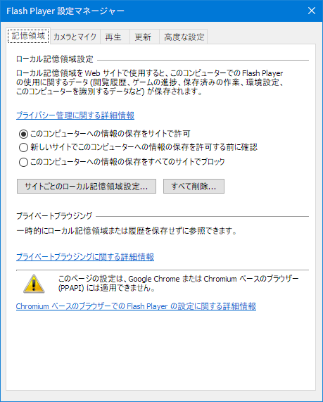

# This is a python script that removing a part of GASP table and bitmap data in Microsoft TrueType Collection font.

## Description

According to [here](http://silight.hatenablog.jp/entry/2017/05/03/144138), ClearType makes processing anti-alias vertically in TrueType Font(TTF) since releasing Windows 10 Creators Update. So I make python script that edits GASP table and remove unnecessary part in TTF. Then strings are beautiful a little than the before. It becomes a better. However Windows font rendering is bad still. So I hope MS adopt a CoolType rendering engine or algorithm. BTW it takes about 20 years old since MS ignoe Japanese language. It's so long. I hope Windows font rendering become a better more and more in the future.

Windows 10 Creators Update で ClearType が[TTF でも縦方向に Anti-Alias するようになった](http://silight.hatenablog.jp/entry/2017/05/03/144138)ということなので、TTF 内の GASP テーブルの不要部分を削除しました。これをするだけで比較的綺麗にフォントが描画されるようになりました。まだ、FreeType にすら劣りますが、これまでのフォントレンダリングと比べたらものすごいマシです。MS が日本語を無視してから約二十年、長かった...。

## USAGE

### Preparing

This script makes a core dump on old fontforge. So please install new fontforge. Especially, fontforge in Ubuntu repository is 2012xxxx still.

- Install fontforge (not 20170731 but 2016xxxx) with python extension.

   * If you use Mac, install fontforge via [homebrew](https://brew.sh).
   * If you use Linux or WSL, install fontforge via [linuxbrew](http://linuxbrew.sh). See [here](./howto-install-fontforge.md).
   * If you use Raspberry Pi 3, install fontforge from tarball. See [here](./howto-install-fontforge.md).

- Copy your font, eg msgothic.ttc, from Windows font directory to your working directory. Default working directory is ~/Downloads/fonts.

I confirm this script on EL Capitan, Sierra, High Sierra, WSL (Xenial), Raspberry Pi 3 (Jessie).

### Step 1 (on Mac or on Linux)

```
python removebitmap.py msgothic.ttc
```

### Step 2 (on Mac or on Linux and on Windows)

```
Move new fonts in ~/Downloads/fonts/new to Windows something folder.
```

### Step 3 (on Windows)

```
Double click new font on Windows and click 'Install' button.
```

If you installed new font even once, you do not have to do step 1, 2, 3 even major upgrade Windows.

### Step 4 (on Windows)

Exec regedit.exe and edit bellow or use bellow my registory files.

```
    - HKLM\software\Microsoft\Windows NT\CurrentVersion\FontLink\SystemLink
    - HKLM\software\Microsoft\Windows NT\CurrentVersion\Fonts
```

### Step 5 (on Windows)

```
Reboot Windows.
```

Enjoy!

## Result

| Font                                | Result | Note        |
|:------------------------------------|:------:|:------------|
| msgothic.ttc (MS Gothic)            | OK     | No problem. |
| msgothic.ttc (MS PGothic)           | OK     | No problem. |
| msgothic.ttc (MS UI Gothic)         | OK     | No problem. |
| meiryo.ttc (Meiryo)                 | OK     | No problem. |
| meiryo.ttc (Meiryo Italic)          | OK     | No problem. |
| meiryo.ttc (Meiryo UI)              | OK     | No problem. |
| meiryo.ttc (Meiryo UI Italic)       | OK     | No problem. |
| meiryob.ttc (Meiryo Bold)           | OK     | No problem. |
| meiryob.ttc (Meiryo Italic Bold)    | OK     | No problem. |
| meiryob.ttc (Meiryo UI Bold)        | OK     | No problem. |
| meiryob.ttc (Meiryo UI Italic Bold) | OK     | No problem. |

YuGo* の結果は割愛。

### Screenshots

Please look below screenshots. Strings becomes a beautiful so so on GDI and DW. I think impact of vertical anti-alias is big. Changed these fonts, msgothic.ttc, meiryo[b].ttc, YuGoth[BLMR].ttc are not processed hinting because script edit font data. These are processed smoothing only every size.

Not user processes font data but ClearType shuld ignores GASP table. But MS does not make it. I do not understand that MS thinks.

GDI も DW もそこそこ綺麗になりました。縦方向 Anti-Alias の影響は大きいです。下のスクショは、msgothic.ttc, meiryo[b].ttc, YuGoth[BLMR].ttc の GASP テーブルを編集し msgothic.ttc のビットマップデータを削除することで、どのフォントサイズでもスムージングのみ、すなわち hinting を無視するようにしたものです。映ってる大部分が源真ゴシックじゃあないかというのはありますが、分かる人が見れば分かると思います。hook 系アプリを必要としないので Windows Update が失敗したり、特定のアプリが動かなかったり、GSOD になったり、ということはありません。

本来ならばフォントデータに手を加えるのではなく、ClearType が GASP テーブルを無視すべきだと思うのですが、未だに MS はそれをしないのが理解できません。


アプリ個別のスクショは以下の通りです。GitHub 上では分からないと思いますので画像をダウンロードして、画像ビューワで実物大でご覧ください。

### cmd (MS Gothic)

bash.exe もこの描画になるので WSL で色々と遊びたくなります。


### Edge

このスクショでは主に Meiryo を表示しています。ClearType と既存の Meiryo で特有の崩れた字体にならずバランスがとても良くなります。


### Flash Player Manager (MS UI Gothic)



### Install Sheld (MS UI Gothic)


### notepad (MS Gothic)


### Store App (YuGoth*)

YuGothic 系は違いが小さくて分かりづらいですが、文字によって字体のバランスが良くなります。やはり今までの ClearType は害悪なのでは？ボブは訝しんだ。


If MS fix the rendering which ignoring GASP table of all fonts, it is good. Why MS makes us using wasted font rendering?

msmincho や segoue などの GASP もいじれば統一感が出て Windows の見映えもより良くなると思います。個人的には ClearType 側で GASP を無視してくれるのが一番なのですが MS はどうして分かってくれないのでしょうか。

## Appendix

### Registory files

1. default-fonts.reg

    HKLM\\...\\CurrentVersion\\Fonts レジストリのデフォルト。

1. default-systemlink.reg

    HKLM\\...\\CurrentVersion\\Fontlink\\SystemLink レジストリのデフォルト。

1. gamma-value.reg

    某掲示板情報によると未だに Cleartype Tuner にはバグがあり、一度でも Cleartype Tuner を使うと Gamma 値が固定されてしまうそうな。

    According to major BBS in Japan, ClearType Tuner has still a bug that Gamma value is fixed.

1. nohinting-gm.reg

    msgothic と meiryo[b] の読み込み先を差し替える fonts レジストリ。

1. nohinting-gmy.reg

    msgothic と meiryo[b] と YuGoth[BLMR] の読み込み先を差し替える fonts レジストリ。

1. nohinting-systemlink-gm.reg

    msgothic と meiryo[b] のリンク先を差し替える SystemLink レジストリ。

1. nohinting-systemlink-gmy.reg

    msgothic と meiryo[b] と YuGoth[BLMR] のリンク先を差し替える SystemLink レジストリ。

## Changelog

- decrease argc.
- Ricty 生成スクリプト群の os2version_riviser.sh を使わなくても「Windows で幅広問題」を回避するようにしました。(Ricty 同梱のスクリプトを meiryo に使うと文字化けします)

## LICENSE

MIT
