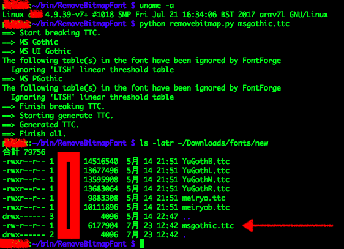
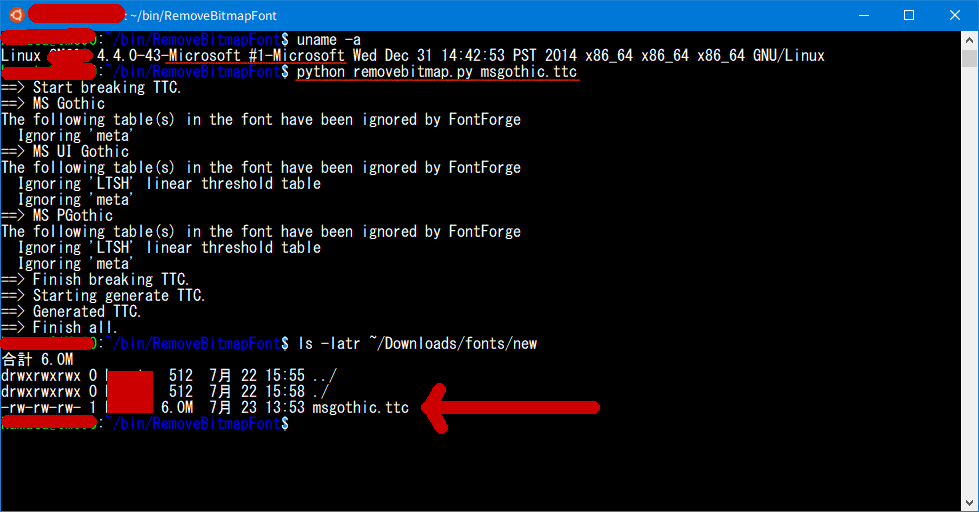

# Howto Install Fontforge.

## For Raspberry Pi 3
1. sudo apt-get update
1. sudo apt-get upgrade
1. sudo apt-get install build-essential curl git m4 ruby texinfo libbz2-dev libcurl4-openssl-dev libexpat-dev libncurses-dev zlib1g-dev libglib2.0-dev
1. git clone https://github.com/fontforge/fontforge.git
1. cd fontforge
1. ./bootstrap && ./configure --enable-pyextension --without-x
1. make
1. sudo make install
1. add 'export LD_LIBRARY_PATH=/usr/local/lib:$LD_LIBRARY_PATH' to your .bashrc

### Result

## For Windows Subsystem Linux (Bash on Windows)
1. Install [linuxbrew](http://linuxbrew.sh)
1. ln -s \`which gcc\` \`brew --prefix\`/bin/gcc-5.4
1. brew install -vd fontforge

    In this step, make check error happens in libxml2. So please choice '2: ignore'.

### Result

